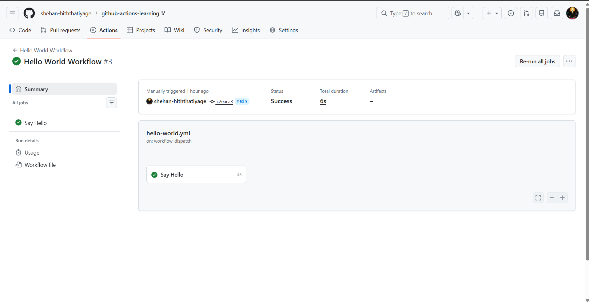
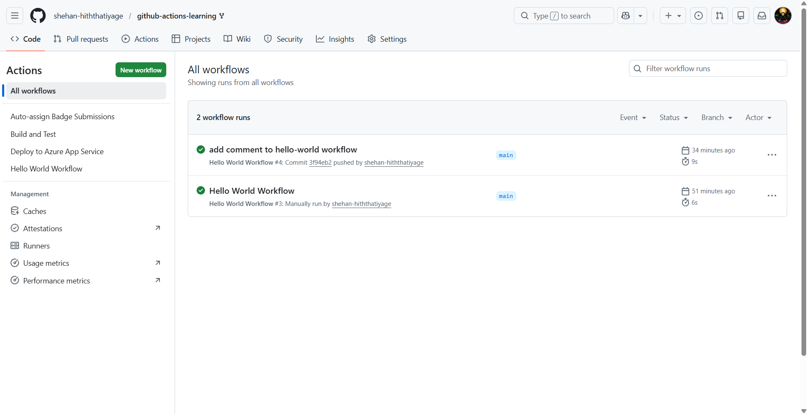
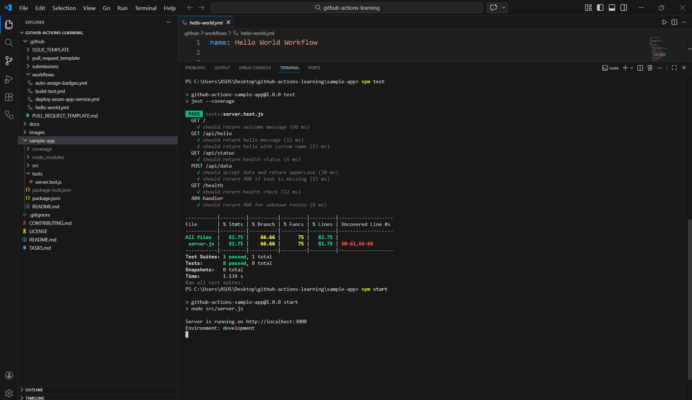

# Beginner Badge Submission - Shehan Hiththatiyage

**Date:** 25 February 2026  
**Status:** Submitted for Review

## Tasks Completed

- [x] Task 1: Run Your First Workflow
- [x] Task 2: Understand Workflow Triggers
- [x] Task 3: Build and Test Locally

## Evidence

### Task 1: Hello World Workflow

### Task 2: Push Trigger

### Task 3: Local Tests

## Notes
Completed all tasks successfully. Workflows triggered correctly and local tests passed.

---

Submitted & ready for review! ✅