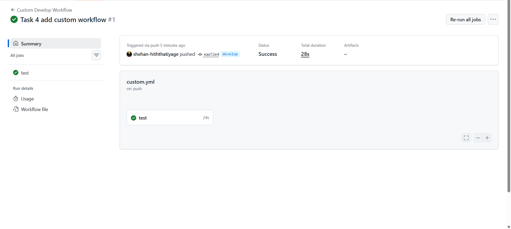
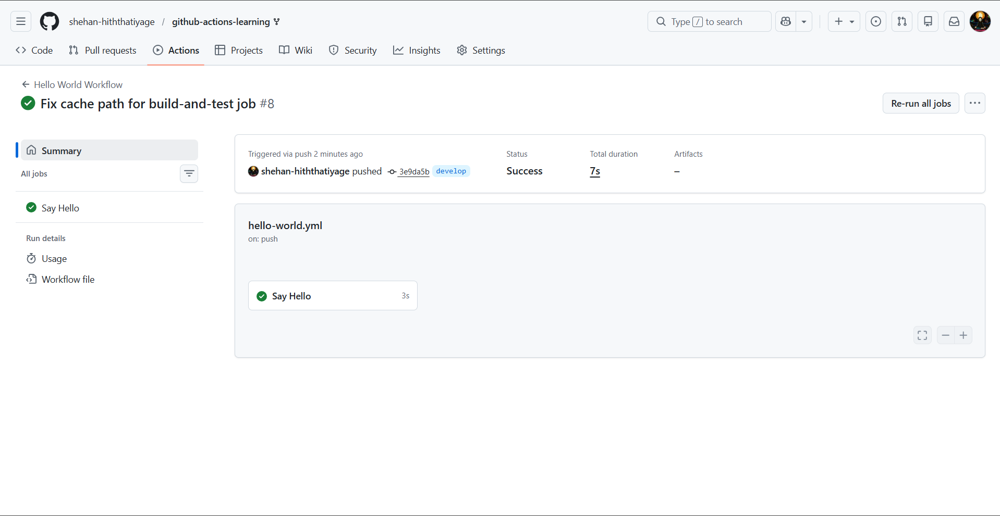
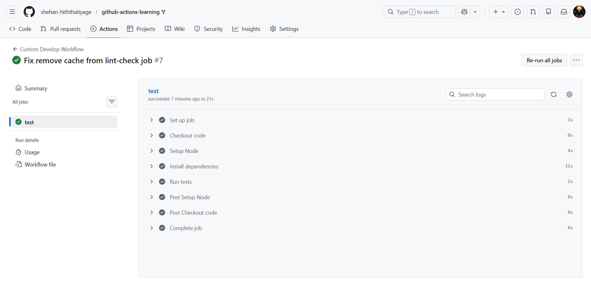
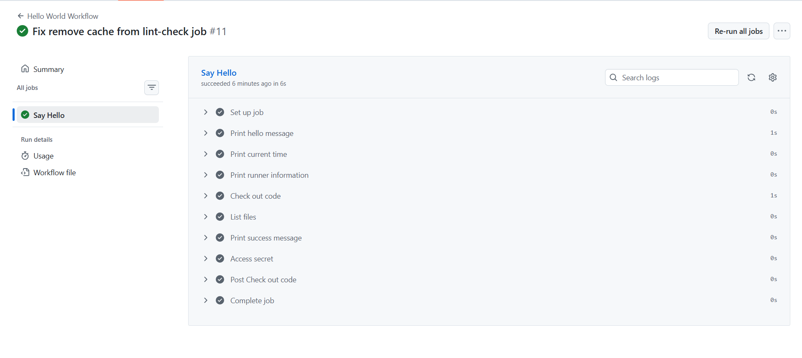

# ⭐⭐ Intermediate Badge Submission - Shehan Hiththatiyage

**Date:** 25 February, 2026  
**Level:** Intermediate  
**Status:** Submitted for Review  

---

## ✅ Tasks Completed

- [x] Task 4: Create a Custom Workflow
- [x] Task 5: Add Environment Variables
- [x] Task 6: Use GitHub Secrets
- [x] Task 7: Matrix Testing (Node 16, 18, 20)

---

##  Evidence

###  Task 4 – Custom Workflow
- Created `.github/workflows/custom.yml`
- Triggered on `develop` branch
- Successfully executed in Actions tab

###  Task 5 – Environment Variables
- Added job-level environment variables:
  - NODE_ENV = test
  - LOG_LEVEL = debug
- Printed variables in workflow logs
- Verified values displayed correctly

###  Task 6 – GitHub Secrets
- Created repository secret: `TEST_SECRET`
- Used secret securely in workflow
- Verified secret masking in logs

###  Task 7 – Matrix Testing
- Configured matrix strategy:
  - Node.js 16.x
  - Node.js 18.x
  - Node.js 20.x
- Verified parallel job execution in Actions tab
- Confirmed successful builds across versions

---

Submitted & ready for review! ✅